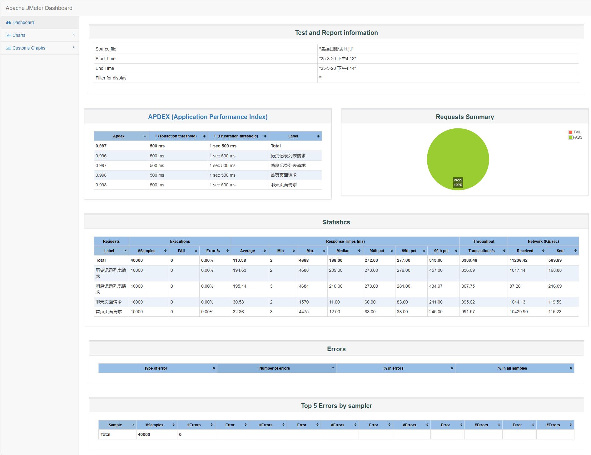

项目介绍
===============
Linux下C++轻量级Web服务器, 可实现与**满血版DeepSeek-R1**对话

* 使用**线程池 + epoll(LT模式)** 实现**Reactor模式**的并发模型
* 使用**状态机**解析HTTP请求报文，支持解析**GET和POST**请求
* 使用**MySQL**数据库存储**用户名、密码、api-key、聊天历史记录**
* 使用**redis**缓存**用户token, 实现请求快速认证**
* 使用**SMTP协议+ redis** 实现用户注册功能
* 实现**异步日志系统**, 记录服务器运行状态
* **经Jemter压力测试**可以实现**上万的并发连接**数据交换

### 体验地址
可访问: http://dva1223.yunmv.cn/ 体验(目前只支持国内访问)

### 压力测试

使用**Jmeter**进行压力测试
每个接口测试**10000次**请求, 持续10s。四个接口同时进行并发测试。
测试结果如下图:

  

**由图所示:** 所有请求均正常相应。两个页面请求的平均响应时间在**30ms**左右。两个记录查询接口由于涉及数据库查询，平均响应时间在**200ms**左右。可以保证用户的良好体验。

### 单独测试聊天接口
使用 `query = "你好"` 作为问题进行测试，测试结果如下
| 选择的模型 | 平均响应时间 | 最小响应时间 | 最大响应时间 | 数据库chats表正确存储比例 | 数据库messages表正确存储比例 |
| :---: | :---: | :---: |  :---: | :---: | :---: |
| deepseek-r1 | 145s | 5s | 252s | 100% | 100% |
| deepseek-v3 | 79s | 2s | 148s | 100% | 100% |

进行测试的时候，最开始的请求响应非常快，但是随后的请求响应越来越慢，分析可能的原因:

1. 数据库连接池中的连接有限，多线程存在连接竞争需要等待。
2. 请求增加导致服务器负载增加，处理请求速度减慢。

### 参考
[TinyWebServer](https://github.com/qinguoyi/TinyWebServer/tree/raw_version)

